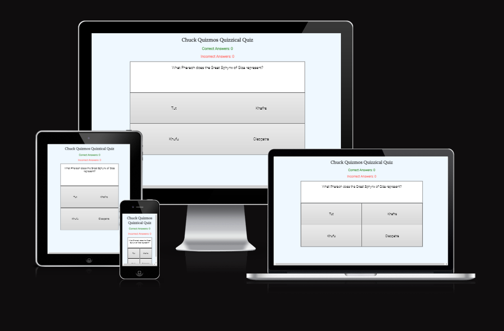
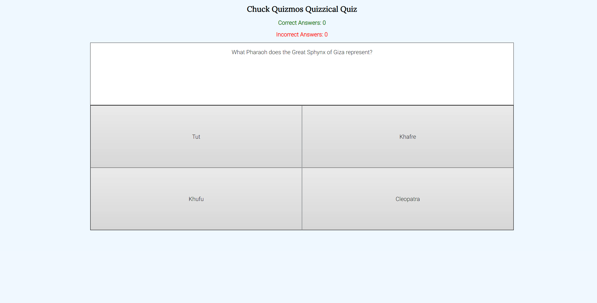
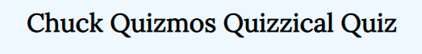
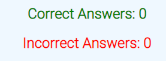
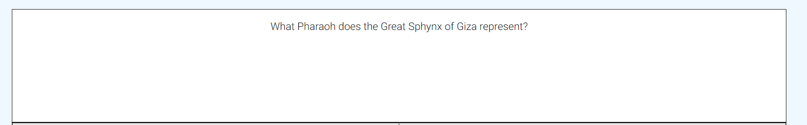
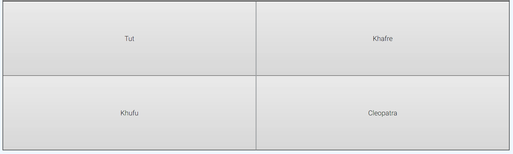
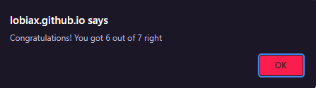
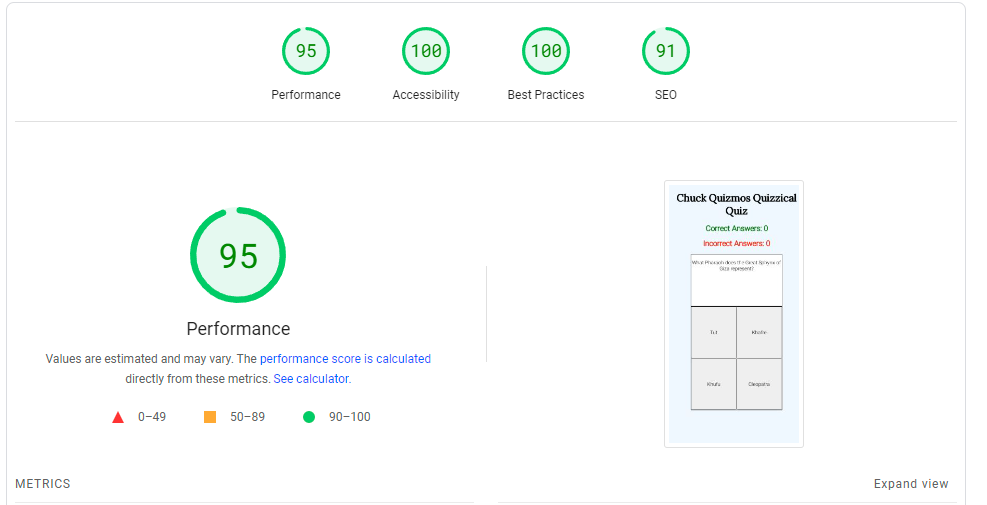

# Chuck Quizmos Quizzical Quiz

- Introduction
- Features
- Testing
- Deployment
- Credits

---

## **Introduction**

Chuck Quizmos Quizzical Quiz is here to puzzle you and challenge your trivia knowledge! Can you get them all right?

### **Screenshots**

- Here is a screenshot of the finished product.

---

## **Features**

### **Heading**

- The heading exists to create awareness of the name and give identity to the quiz which otherwise would be very forgettable.

---

### **Incrementers**

- The incrementers provide feedback to the user on how they're doing and keeps track of their score.

- The values of the incrementers also help influence whether the user get a positive or a negative alert at the end of the quiz.

---

### **Question**

- The largest portion of the space of the screen is allocated to the current question of the trivia so that the user has as easy of a time as possible to read it and make their guess.

- Using the displayQuestion function in conjunction with the checkAnswer function increment and keep the same question from repeating.

---

### **Answer Area**

- The quiz is a multiple choice quiz.
- The user is given 4 choices to try and guess right.

### **Alert**

- At the end of the quiz the user is given an alert to tell them how they did.
- There are two possible alerts, one positive if a high score is achieved and one less congratulatory if the user didn't do so well.

---

## **Testing**

### **Validation**

- All HTML pages have been checked with the official W3C HTML validator and received no errors.

- The CSS page have been checked with the official jigsaw W3C CSS validator and comes back with no errors.
- The JavaScript have been checked with JSHint and comes back without warnings.

### **Responsiveness**

- The website has been thoroughly checked on desktop with browsers Chrome, Edge and Opera with no irregularities found.

- Testing to ensure that the pages are responsive have been done in devtools as well as on my own and my girlfriends smartphones.

### **Bugs**

- A previous bug allowed the user to keep playing after the quiz was complete without it properly reseting. This has since been fixed by changing the parameters of an if clause.
- No currently known unfixed bugs.

### **Version Control**

- The live site has been version controlled to ensure that it is up-to-date.

### **Lighthouse**

- I ran the website through the Lighthouse function both on devtools and on [pagespeed.web.dev](https://pagespeed.web.dev)

- It yielded good results and i believe no bigger changes need be done.

---

## **Deployment**

- The site was deployed through Github pages. The following are the steps i took to do so.

- In the github repository for the project i first click on 'settings'.

- Then on the left hand side of the screen i click the 'pages' option

- I then chose to deploy from a branch and when asked what branch to deploy from i select 'main branch'.

- After a few minutes i can now see that the page is deployed and that the site is live.

- The current live site is [Here](https://lobiax.github.io/chuck-quizmos-quizzical-quiz/)

---

## **Credits**

### **Content/Code**

- The code for the incrementing score/incorrect answer functions was almost copied from the Love Maths walkthrough project.

- While no code was copied i used w3schools and developer.mozilla to see proper syntax for forEach functions, arrow functions, if/else functions and how to convert an object into an array.
